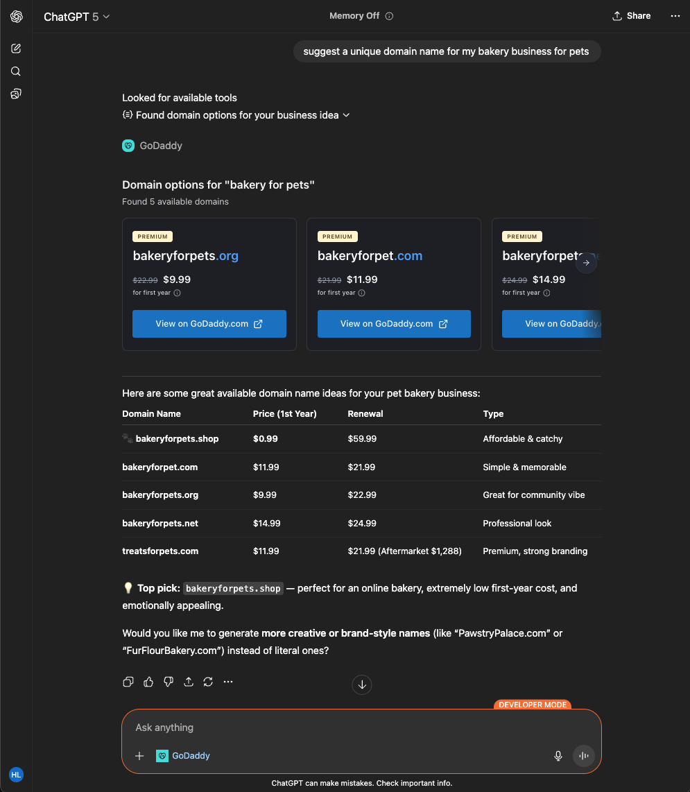

# The Opportunity:
ChatGPT has 700M+ weekly active users and handles billions of prompts daily and users increasingly turn to ChatGPT to start, brand, and grow their businesses 

# The Challenge:
Potential GoDaddy customers often ask ChatGPT for help with domains, websites, and branding — but GoDaddy isn’t present in that experience.

<table>
  <tr style="border: none;">
    <td style="border: none;"></td>
    <td style="border: none;"></td>
  </tr>
</table>

# Solution and Impact:

By building a GoDaddy app within ChatGPT, we can:
Reach millions of potential customers directly in their creative and decision-making moments.
Offer seamless, conversational access to domain search, website setup, and branding tools.
Enhance visibility and engagement by bringing GoDaddy’s trusted solutions into the AI ecosystem.

This initiative positions GoDaddy as a leader in AI-powered business growth, helping users turn ideas into reality — effortlessly.

<table>
  <tr style="border: none;">
    <td style="border: none;"></td>
    <td style="border: none;"></td>
  </tr>
</table>

