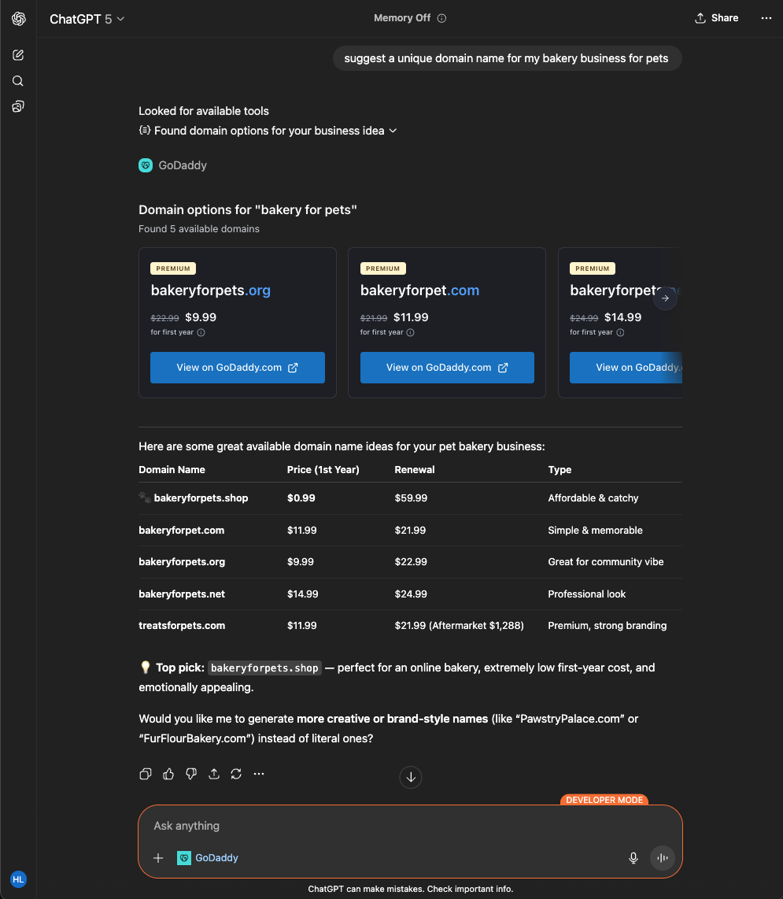
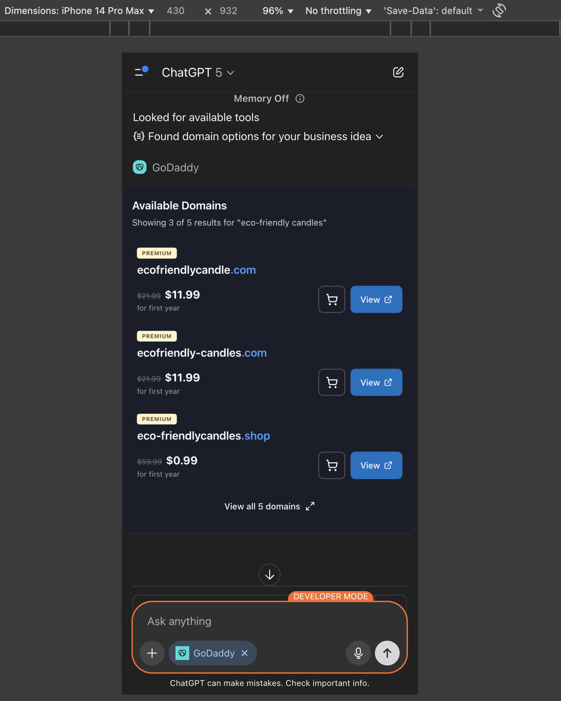
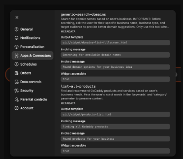
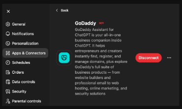

# GoDaddy Domain Search App

[](LICENSE)

This repository showcases a GoDaddy domain search application built with the Apps SDK and MCP (Model Context Protocol). It provides domain search functionality with rich UI components that can be used within ChatGPT conversations. Here is the [problem statement](./ProblemStatement.md)

The app demonstrates domain search tools with interactive widgets for domain availability checking, domain recommendations, and product suggestions.

<table>
  <tr style="border: none;">
    <td style="border: none;"></td>
    <td style="border: none;"></td>
  </tr>
</table>

## MCP + Apps SDK overview

The Model Context Protocol (MCP) is an open specification for connecting large language model clients to external tools, data, and user interfaces. An MCP server exposes tools that a model can call during a conversation and returns results according to the tool contracts. Those results can include extra metadata—such as inline HTML—that the Apps SDK uses to render rich UI components (widgets) alongside assistant messages.

Within the Apps SDK, MCP keeps the server, model, and UI in sync. By standardizing the wire format, authentication, and metadata, it lets ChatGPT reason about your connector the same way it reasons about built-in tools. A minimal MCP integration for Apps SDK implements three capabilities:

1. **List tools** – Your server advertises the tools it supports, including their JSON Schema input/output contracts and optional annotations (for example, `readOnlyHint`).
2. **Call tools** – When a model selects a tool, it issues a `call_tool` request with arguments that match the user intent. Your server executes the action and returns structured content the model can parse.
3. **Return widgets** – Alongside structured content, return embedded resources in the response metadata so the Apps SDK can render the interface inline in the Apps SDK client (ChatGPT).

Because the protocol is transport agnostic, you can host the server over Server-Sent Events or streaming HTTP—Apps SDK supports both.

The MCP servers in this demo highlight how each tool can light up widgets by combining structured payloads with `_meta.openai/outputTemplate` metadata returned from the MCP servers.

## Repository structure

- `src/` – Source for domain search widget components and utilities.
- `assets/` – Generated HTML, JS, and CSS bundles after running the build step.
- `domains_server_node/` – MCP server implemented with the official TypeScript SDK for domain search functionality.
- `build-all.mts` – Vite build orchestrator that produces hashed bundles for every widget entrypoint.

### Domain Components

- `domain-available/` – Widget for displaying available domains
- `domain-unavailable/` – Widget for displaying unavailable domains  
- `domains-carousel/` – Carousel widget for browsing domains
- `domains-list-fullscreen/` – Fullscreen domain list view
- `products-list/` – Widget for displaying product recommendations
- `products-recommend/` – Widget for product suggestions

## Prerequisites

- Node.js 18+
- pnpm (recommended) or npm/yarn

## Install dependencies

Clone the repository and install the workspace dependencies:

```bash
pnpm install
```

> Using npm or yarn? Install the root dependencies with your preferred client and adjust the commands below accordingly.

## Build the components gallery

The components are bundled into standalone assets that the MCP servers serve as reusable UI resources.

```bash
pnpm run build
```

This command runs `build-all.mts`, producing versioned `.html`, `.js`, and `.css` files inside `assets/`. Each widget is wrapped with the CSS it needs so you can host the bundles directly or ship them with your own server.

To iterate on your components locally, you can also launch the Vite dev server:

```bash
pnpm run dev
```

## Serve the static assets

If you want to preview the generated bundles without the MCP servers, start the static file server after running a build:

```bash
pnpm run serve
```

The assets are exposed at [`http://localhost:4444`](http://localhost:4444) with CORS enabled so that local tooling (including MCP inspectors) can fetch them.

## Run the MCP server

The repository includes a domain search MCP server that provides domain search functionality with rich UI components.

Every tool response includes plain text content, structured JSON, and `_meta.openai/outputTemplate` metadata so the Apps SDK can hydrate the matching widget.

### Domain Search Server

```bash
cd domains_server_node
pnpm start
```

This server provides tools for:
- Domain availability checking
- Domain recommendations
- Product suggestions
- Domain search with various filters

## Testing in ChatGPT

To add these apps to ChatGPT, enable [developer mode](https://platform.openai.com/docs/guides/developer-mode), and add your apps in Settings > Connectors.

To add your local server without deploying it, you can use a tool like [ngrok](https://ngrok.com/) to expose your local server to the internet.

For example, once your mcp servers are running, you can run:

```bash
ngrok http 8000
```

You will get a public URL that you can use to add your local server to ChatGPT in Settings > Connectors.

For example: `https://<custom_endpoint>.ngrok-free.app/mcp`

Once you add a connector verify tools and you are ready to use it in ChatGPT conversations.

<table>
  <tr style="border: none;">
    <td style="border: none;"></td>
    <td style="border: none;"></td>
  </tr>
</table>

You can add your app to the conversation context by selecting it in the "More" options.


You can then invoke tools by asking something related. For example, for the domain search app, you can ask "Search for available domains for my business" or "Find domain recommendations for a tech startup".

## Next steps

- Customize the widget data: edit the handlers in `domains_server_node/src` to fetch data from your domain search systems.
- Create your own domain-related components: drop new entries into `src/` and they will be picked up automatically by the build script.
- Integrate with real domain APIs: replace the mock data with actual domain availability checking services.

### Deploy your MCP server

You can use the cloud environment of your choice to deploy your MCP server.

Include this in the environment variables:

```
BASE_URL=https://your-server.com
```

This will be used to generate the HTML for the widgets so that they can serve static assets from this hosted url.

## References

**ChatGPT Developer Docs:**
- [OpenAI Apps SDK Documentation](https://developers.openai.com/apps-sdk)
- [Apps SDK Build Examples](https://developers.openai.com/apps-sdk/build/examples)
- [Introducing Apps in ChatGPT](https://openai.com/index/introducing-apps-in-chatgpt/)

**Development Tools:**
- [Ngrok Setup Guide](https://dashboard.ngrok.com/get-started/setup/macos)

**API References:**
- GoDaddy Domain Find API
- AiroHQ serp-agent for UX inspiration
- Booking.com ChatGPT app for UX inspiration


## License

This project is licensed under the MIT License. See [LICENSE](./LICENSE) for details.
